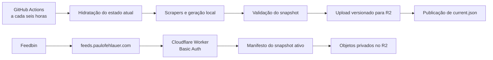

# Publicação privada de feeds com Cloudflare Worker

**Status:** publicação privada completa ativa no domínio definitivo; o primeiro
ciclo agendado depois da correção dos gates foi validado, a migração no Feedbin
foi concluída e o corte público permanece fechado, com GitHub Pages preservado
**Última revisão:** 2026-07-27
**Origem:** item “Publicação privada dos feeds com compatibilidade com o Feedbin” do [`BACKLOG.md`](../BACKLOG.md)

## 1. Resumo executivo

Esta especificação descreve a migração dos feeds gerados pelo projeto de uma
publicação pública no GitHub Pages para uma distribuição privada compatível com
o Feedbin.

A arquitetura de referência é:

- código e configuração permanecem no repositório atual;
- artefatos gerados e estado de execução deixam de ser versionados publicamente;
- o GitHub Actions continua executando os scrapers a cada seis horas;
- um bucket Cloudflare R2 privado armazena snapshots completos da publicação;
- um Cloudflare Worker é a única porta de leitura dos artefatos;
- o Worker exige HTTP Basic Auth sobre HTTPS;
- o Feedbin armazena as credenciais de cada assinatura protegida;
- a publicação pública atual só é desligada depois de um piloto e de uma
  migração verificada.

O Worker não executa os scrapers e não precisa ser reimplantado a cada
atualização dos feeds. A implantação do código de entrega e a publicação de
conteúdo são operações independentes.

## 2. Estado da decisão

### 2.1 Baseline recomendado

| Tema | Baseline |
|---|---|
| Topologia do repositório | Código público e artefatos privados |
| Serviço de entrega | Cloudflare Worker |
| Armazenamento | Cloudflare R2 Standard, bucket privado |
| Autenticação | HTTP Basic Auth sobre HTTPS |
| Domínio canônico | `paulofehlauer.com` |
| Domínio de produção dos feeds | `feeds.paulofehlauer.com` |
| Domínio de piloto | Subdomínio temporário `workers.dev`, desabilitado depois da validação |
| Publicação | Snapshots versionados com ponteiro atômico |
| Estado do pipeline | Feeds anteriores e `history/` no R2 |
| Retenção | 28 snapshots, equivalentes a sete dias no ritmo atual |
| Feeds RSS nativos | Continuam apontando para os provedores originais |
| OPML | Privado, servido pelo mesmo Worker |
| Índice HTML | Desabilitado ou privado; nunca público com o inventário completo |
| Cache | Sem cache público; revalidação condicional com ETag |

### 2.2 Decisões resolvidas e gates restantes

Decisões aplicadas na implementação local:

1. o repositório continua público e os artefatos passam a ser privados somente
   no gate de corte;
2. os sete agregados legados e três feeds órfãos não entram na allowlist;
3. o OPML é privado e o índice HTML não é publicado;
4. uma credencial comum é aceita inicialmente, com duas senhas durante rotação;
5. não haverá reescrita de histórico;
6. os dois RSS nativos continuam apontando diretamente para os provedores.

Estado dos gates externos:

1. publicação completa manual concluída em 2026-07-25 no snapshot
   `30170506858-1-bc9e2a6055ac`;
2. o Environment havia sido configurado com
   `PRIVATE_FEED_FULL_ENABLED=true`, `PRIVATE_FEED_PILOT_ENABLED=false` e
   canário `drauzio_feed.xml`;
3. as quatro execuções agendadas de 2026-07-26 terminaram como `skipped`
   antes de qualquer step porque um `jobs.<job_id>.if` não consegue usar uma
   configuration variable disponível somente depois que o Environment é
   declarado pelo runner;
4. em `2026-07-26T23:04Z`, os dois gates foram transferidos para variables do
   repositório, com os valores `true` e `false` preservados e os duplicados do
   Environment removidos;
5. o run agendado `30237068708` concluiu com sucesso em 2026-07-27, sem
   disparo manual, e ativou `30237068708-1-57ac4cee27df`;
6. a migração foi autorizada e concluída em 2026-07-27: 86 assinaturas que
   apontavam para o GitHub Pages foram recriadas manualmente em cinco lotes,
   somando 87 assinaturas privadas com o piloto de Drauzio;
7. depois da validação inicial dos lotes, as 87 assinaturas antigas do GitHub
   Pages foram removidas do Feedbin, incluindo um órfão legado;
8. remoção da publicação pública e do GitHub Pages continua exigindo
   autorização adicional depois da estabilização do conjunto privado.

### 2.3 Premissas

- O serviço é destinado ao uso pessoal de um único operador.
- O Feedbin é o cliente de leitura que define a compatibilidade mínima.
- Não haverá clientes anônimos para os feeds com conteúdo integral.
- O agendamento continuará no GitHub Actions.
- O volume permanecerá próximo da ordem de centenas, não milhões, de feeds.
- Uma credencial compartilhada é aceitável como ponto de partida, desde que
  exista procedimento de rotação.
- Privacidade reduz exposição, mas não transforma conteúdo de terceiros em
  conteúdo livre de restrições autorais.
- Preços, limites e recursos da Cloudflare serão revistos antes da execução.

### 2.4 Decisão de domínio

Decisão registrada em 2026-07-24:

- `paulofehlauer.com` é o domínio canônico;
- `feeds.paulofehlauer.com` será o endpoint definitivo dos feeds privados;
- o piloto usou uma URL temporária `workers.dev`, desabilitada depois da
  validação no domínio definitivo;
- `paulofehlauer.com` continuará redirecionando para o Linktree durante a
  migração de DNS;
- a configuração do Worker não deve interferir no redirecionamento do domínio
  principal;
- `fehla.xyz` permanece como domínio legado até pelo menos seu vencimento em
  abril de 2027;
- não serão criadas URLs definitivas de feeds sob `fehla.xyz`;
- não é necessário adquirir outro domínio para esta implementação.

Antes de alterar os nameservers de `paulofehlauer.com`:

1. exportar ou registrar todos os DNS records existentes;
2. conferir especialmente `A`, `AAAA`, `CNAME`, `MX`, `TXT` e `CAA`;
3. documentar como o redirecionamento para o Linktree funciona atualmente;
4. recriar e validar esses comportamentos na Cloudflare;
5. somente então trocar a delegação DNS;
6. verificar o domínio principal antes de criar o Custom Domain do Worker.

## 3. Objetivos

### 3.1 Objetivos funcionais

- Servir os feeds gerados por URLs HTTPS estáveis.
- Exigir autenticação antes de entregar conteúdo ou metadados dos feeds.
- Manter compatibilidade com o Feedbin.
- Continuar atualizando os feeds automaticamente a cada seis horas.
- Preservar a lógica que impede a substituição de conteúdo integral por stubs
  durante falhas transitórias.
- Permitir rollback rápido para a publicação anterior.
- Oferecer um OPML privado para cadastro e recuperação.
- Permitir adição e remoção de fontes sem alterar o código do Worker.

### 3.2 Objetivos não funcionais

- Nenhum segredo no Git, nos XMLs, no OPML gerado pelo projeto ou nos logs.
- Exportações de terceiros que materializem credenciais devem ser tratadas
  como arquivos secretos, nunca como OPML operacional ou artefato versionável.
- Nenhum bucket, endpoint alternativo ou origem pública que contorne o Worker.
- Publicação de todos os feeds como uma unidade consistente.
- URLs independentes do domínio `workers.dev` em produção.
- Self-links e OPML usando `https://feeds.paulofehlauer.com`.
- Operação compatível com a faixa gratuita da Cloudflare na escala atual.
- Diagnóstico que diferencie falha de coleta, validação, publicação,
  autenticação e entrega.
- Mudança reversível até o desligamento final do GitHub Pages.

### 3.3 Fora de escopo

- Alterar a frequência dos scrapers.
- Corrigir ou criar scrapers sem relação direta com a publicação privada.
- Usar Cloudflare Access, OAuth ou uma interface de login interativa.
- Reescrever o histórico Git sem autorização específica.
- Tratar a autenticação como solução completa para questões autorais.
- Tornar privados os RSS oficiais que continuarem sendo consumidos diretamente
  dos provedores.

## 4. Inventário de baseline e restrições atuais

Baseline anterior à publicação privada, registrado em 2026-07-24:

- 109 fontes configuradas;
- 107 fontes processadas pelo pipeline;
- 2 fontes com RSS nativo, não processadas pelo `main.py`;
- 119 XMLs presentes em `feeds/`;
- aproximadamente 5,3 MB de artefatos em `feeds/`;
- execução agendada quatro vezes ao dia;
- publicação atual por commit de `feeds/` e `history/`;
- URLs internas baseadas em
  `https://paulofeh.github.io/rss-de-valor`.
- `paulofehlauer.com` controlado pelo usuário e atualmente usado como
  redirecionamento para o Linktree;
- `fehla.xyz` mantido como domínio legado, sem receber as URLs definitivas dos
  feeds privados.

Os 119 XMLs incluem os 109 nomes de feed declarados na configuração, sete
agregados legados e três feeds órfãos de fontes removidas. O `main.py` atual
regenera 107 feeds e não regenera os sete agregados, os três órfãos nem as
cópias locais das duas fontes com RSS nativo. Portanto, o processo futuro
não deve publicar cegamente tudo o que encontrar em `feeds/*.xml`.

Estado reconciliado em 2026-07-27, depois da remoção da fonte de YouTube:

- 108 fontes configuradas;
- 106 feeds gerados pelo pipeline;
- 2 RSS nativos mantidos diretamente nos provedores;
- 106 históricos, um OPML e 106 XMLs no manifesto privado;
- 213 objetos internos e 107 rotas privadas no modo `full`.

O inventário público legado pode conter arquivos que não pertencem ao
manifesto privado. A presença no disco nunca é autorização de publicação.

A lista de objetos publicáveis deve ser construída a partir de:

1. fontes geradas ativas em `config/sources_config.json`;
2. OPML e índice explicitamente habilitados;
3. feeds agregados explicitamente habilitados.

## 5. Arquitetura



### 5.1 Componentes

#### GitHub Actions

Responsável por:

- hidratar feeds anteriores e estado;
- executar o pipeline existente;
- validar os artefatos;
- montar um snapshot;
- fazer upload ao R2;
- ativar o novo snapshot;
- testar o endpoint publicado;
- aplicar retenção somente depois da ativação bem-sucedida.

#### Cloudflare R2

Responsável por:

- armazenar snapshots imutáveis;
- armazenar o ponteiro para o snapshot ativo;
- fornecer os objetos ao Worker por binding privado;
- manter versões recentes suficientes para rollback.

O bucket não deve ter:

- domínio público conectado;
- URL pública `r2.dev` habilitada;
- permissão anônima;
- credencial compartilhada entre leitura pública e publicação.

#### Cloudflare Worker

Responsável por:

- terminar HTTPS;
- autenticar requisições;
- validar método e caminho;
- resolver o snapshot ativo;
- buscar o objeto no R2;
- responder com cabeçalhos RSS e cache condicional;
- ocultar a existência de caminhos para clientes não autenticados.

O Worker preserva `ETag`, `Last-Modified`, `HEAD` e `304`. Como respostas
streaming do runtime podem usar transferência em blocos, `Content-Length` é
opcional; quando presente, o canário exige que seja correto, e o tamanho e o
SHA-256 do corpo são verificados independentemente.

O Worker não deve:

- executar scraping;
- escrever feeds;
- aceitar uploads públicos;
- listar objetos do bucket para o cliente;
- registrar o cabeçalho `Authorization`;
- depender do GitHub Pages como origem.

#### Feedbin

Responsável por:

- armazenar a URL e as credenciais do feed;
- buscar o XML periodicamente;
- reutilizar ETag ou `Last-Modified` quando suportado;
- manter a experiência de leitura.

## 6. Estrutura de armazenamento

### 6.1 Chaves do R2

```text
current.json

snapshots/
  2026-07-24T18-00-00Z-<sha>/
    manifest.json
    feeds/
      drauzio_feed.xml
      ...
    metadata/
      feeds.opml
      index.html
    history/
      drauzio_varella_history.json
      ...
```

O identificador do snapshot deve incluir:

- data e hora UTC;
- um identificador único ou SHA curto do commit;
- apenas caracteres seguros para chaves e logs.

### 6.2 `current.json`

Exemplo:

```json
{
  "schema_version": 1,
  "run_id": "2026-07-24T18-00-00Z-a1b2c3d",
  "manifest_key": "snapshots/2026-07-24T18-00-00Z-a1b2c3d/manifest.json",
  "manifest_sha256": "<sha256>",
  "published_at": "2026-07-24T18:14:32Z"
}
```

Esse arquivo é o único objeto mutável necessário durante a publicação normal.
Ele só pode ser atualizado depois que o snapshot estiver completo e validado.

### 6.3 `manifest.json`

Exemplo reduzido:

```json
{
  "schema_version": 1,
  "run_id": "2026-07-24T18-00-00Z-a1b2c3d",
  "created_at": "2026-07-24T18:13:58Z",
  "source_revision": "a1b2c3d",
  "canary_path": "/feeds/drauzio_feed.xml",
  "counts": {
    "feeds": 107,
    "history_files": 107,
    "metadata_files": 1,
    "objects": 215,
    "routes": 108
  },
  "objects": {
    "feeds/drauzio_feed.xml": {
      "key": "snapshots/2026-07-24T18-00-00Z-a1b2c3d/feeds/drauzio_feed.xml",
      "content_type": "application/rss+xml; charset=utf-8",
      "size": 43125,
      "sha256": "<sha256>",
      "last_modified": "2026-07-24T18:13:51Z"
    }
  },
  "routes": {
    "/feeds/drauzio_feed.xml": {
      "object_path": "feeds/drauzio_feed.xml"
    }
  }
}
```

Regras:

- o Worker só entrega caminhos presentes no manifesto;
- o manifesto não é servido diretamente;
- cada arquivo tem tamanho e hash;
- contagens esperadas fazem parte da validação;
- o manifesto é imutável depois de ativado.

## 7. Contrato HTTP

### 7.1 Rotas

| Método | Caminho | Comportamento |
|---|---|---|
| `GET` | `/feeds/<feed_file>` | Entrega um RSS autenticado |
| `HEAD` | `/feeds/<feed_file>` | Mesmos cabeçalhos, sem corpo |
| `GET` | `/feeds.opml` | Entrega o OPML privado |
| `HEAD` | `/feeds.opml` | Mesmos cabeçalhos, sem corpo |
| `GET` | `/` | Índice privado, se habilitado; caso contrário `404` |
| `GET`, `HEAD` | `/healthz` | Verificação autenticada do Worker, ponteiro, manifesto e canário |

Qualquer caminho deve passar pela autenticação antes da resolução do objeto.

### 7.2 Respostas de autenticação

Sem credenciais ou com credenciais inválidas:

```http
HTTP/1.1 401 Unauthorized
WWW-Authenticate: Basic realm="Private feeds", charset="UTF-8"
Cache-Control: no-store
Content-Type: text/plain; charset=utf-8
```

O corpo deve ser curto e genérico. Ausência de credencial, usuário inexistente e
senha incorreta devem produzir a mesma resposta observável.

### 7.3 Resposta de feed

```http
HTTP/1.1 200 OK
Content-Type: application/rss+xml; charset=utf-8
Cache-Control: private, no-cache
ETag: "<sha256-ou-etag-do-objeto>"
Last-Modified: <data HTTP>
X-Content-Type-Options: nosniff
```

Regras:

- `If-None-Match` válido retorna `304 Not Modified`;
- `If-Modified-Since` pode ser usado como fallback;
- `HEAD` retorna os mesmos cabeçalhos de `GET`;
- feeds inexistentes retornam `404` somente depois da autenticação;
- métodos não suportados retornam `405` somente depois da autenticação;
- respostas de erro não incluem nomes de bucket, chaves internas ou stack
  traces.

### 7.4 Saúde

`/healthz` deve testar:

1. leitura de `current.json`;
2. leitura e parsing do manifesto;
3. existência de ao menos um objeto canário declarado.

Resposta autenticada:

```json
{
  "status": "ok",
  "run_id": "2026-07-24T18-00-00Z-a1b2c3d"
}
```

Não deve retornar lista de feeds nem detalhes de credenciais.

## 8. Autenticação e segredos

### 8.1 Modelo inicial

Usar:

- um par atual de usuário e senha;
- opcionalmente um segundo par durante rotação;
- comparação em tempo constante;
- senha com mínimo operacional de 24 bytes e usuário Basic sem `:`;
- HTTPS obrigatório.

O Worker deve aceitar:

```text
(usuário atual AND senha atual)
OR
(usuário de transição AND senha de transição)
```

Se `BASIC_AUTH_USERNAME_NEXT` não estiver configurado, o usuário de transição
é o usuário atual. Isso preserva a rotação somente de senha sem aceitar pares
cruzados durante uma rotação completa.

### 8.2 Segredos do Worker

| Nome | Tipo | Uso |
|---|---|---|
| `BASIC_AUTH_USERNAME` | Secret | Usuário aceito |
| `BASIC_AUTH_PASSWORD_CURRENT` | Secret | Senha principal |
| `BASIC_AUTH_USERNAME_NEXT` | Secret opcional | Usuário do par de transição |
| `BASIC_AUTH_PASSWORD_NEXT` | Secret opcional | Janela de rotação |

O binding do R2 é configurado no Worker, mas não concede acesso público ao
bucket.

### 8.3 Segredos do GitHub Actions

| Nome | Escopo |
|---|---|
| `R2_ACCOUNT_ID` | Variable da conta Cloudflare |
| `R2_ACCESS_KEY_ID` | Token S3 limitado ao bucket |
| `R2_SECRET_ACCESS_KEY` | Token S3 limitado ao bucket |
| `R2_BUCKET` | Variable com o nome do bucket |
| `PRIVATE_FEED_PILOT_ENDPOINT` | Variable com `https://feeds.paulofehlauer.com` |
| `PRIVATE_FEED_FULL_ENABLED` | Variable de repositório usada no `jobs.<job_id>.if`; `false` até a primeira publicação manual completa |
| `PRIVATE_FEED_PILOT_ENABLED` | Variable de repositório usada no `jobs.<job_id>.if`; normalmente `false` |
| `PRIVATE_FEED_FULL_CANARY_FEED_FILE` | Variable com um feed gerado da allowlist |
| `PRIVATE_FEED_USERNAME` | Teste canário autenticado |
| `PRIVATE_FEED_PASSWORD` | Teste canário autenticado |

Gates usados no `jobs.<job_id>.if` precisam estar disponíveis antes de o job
ser enviado ao runner; uma variable definida somente no Environment não atende
esse contrato. As demais configurações não sensíveis podem continuar no
Environment, e valores sensíveis permanecem secrets. Para produção:

```text
FEED_BASE_URL=https://feeds.paulofehlauer.com
```

O bootstrap do piloto usou a origem temporária `workers.dev`. Depois da
validação do Custom Domain, `PRIVATE_FEED_PILOT_ENDPOINT` e `FEED_BASE_URL`
passaram a usar `https://feeds.paulofehlauer.com`; snapshots completos recusam
qualquer origem diferente desse domínio canônico.

Se o Worker for implantado por GitHub Actions, usar um token separado e
restrito à edição do Worker. A credencial de publicação de objetos não deve
poder alterar o Worker ou configurações de domínio.

### 8.3.1 Exportações do Feedbin

Durante o inventário de 2026-07-27, observou-se que o arquivo
`subscriptions.xml` exportado pelo Feedbin incorporou as credenciais Basic no
campo `xmlUrl`. Esse comportamento é do export do serviço, não do OPML gerado
pelo projeto, mas exige uma exceção operacional explícita à premissa de que
todo arquivo com extensão XML ou OPML é seguro para circulação.

Aplicam-se as seguintes regras:

- tratar qualquer export de assinaturas do Feedbin como um segredo até
  verificar o contrário;
- nunca enviar o arquivo bruto ao Git, a logs ou à conversa;
- produzir inventários somente a partir de uma cópia sanitizada, removendo
  `userinfo` das URLs antes de qualquer uso;
- eliminar a cópia bruta depois da reconciliação e lembrar que mover para o
  Lixo não equivale a apagamento permanente;
- não usar o export como OPML de produção.

Na migração, o usuário moveu o export bruto para o Lixo e decidiu manter o par
de credenciais atual sem rotação. Uma verificação somente leitura confirmou que
o arquivo não permanece em Downloads; o conteúdo do Lixo não pôde ser
inspecionado por restrições do macOS. Nenhum valor foi copiado para o
repositório.

### 8.4 Rotação sem indisponibilidade

1. Gerar nova senha.
2. Configurá-la como `BASIC_AUTH_PASSWORD_NEXT`.
3. Confirmar que senha antiga e nova funcionam.
4. Atualizar as credenciais no Feedbin.
5. Aguardar ao menos uma atualização automática de todos os feeds.
6. Promover a nova senha para `BASIC_AUTH_PASSWORD_CURRENT`.
7. Remover a senha antiga.
8. Confirmar `401` com a senha revogada.

O piloto deve verificar se o Feedbin permite atualização em lote. Até haver
evidência, planejar a rotação como operação potencialmente individual por
assinatura.

## 9. Pipeline de publicação

### 9.1 Fase 1 — checkout e ambiente

1. Entrar no mesmo grupo de concorrência usado por publicação e rollback, sem
   cancelar uma execução já em andamento.
   Usar `queue: max` para não descartar uma publicação pendente.
2. Checkout do código com permissão `contents: read`.
3. Instalação das dependências Python.
4. Configuração das credenciais R2 somente no ambiente do job.
5. Geração de `run_id`.

Publicações concorrentes devem ser serializadas. Caso contrário, uma execução
mais antiga que termine por último pode substituir `current.json` de uma
execução mais nova.

### 9.2 Fase 2 — hidratação

Se existir `current.json`:

1. baixar o manifesto ativo;
2. baixar os feeds gerados ativos para `feeds/`;
3. baixar os arquivos de `history/`;
4. verificar hashes e tamanhos;
5. abortar se o estado obrigatório estiver corrompido ou incompleto.

Durante a remoção de uma fonte, o snapshot ativo anterior pode conter objetos
legados que já não pertencem à configuração atual. A hidratação deve aceitar
esse superset somente para a transição, ignorar os objetos extras e baixar
apenas os caminhos derivados da allowlist atual. A ausência de qualquer objeto
exigido pela configuração atual continua sendo fatal. O snapshot seguinte deve
conter exatamente a allowlist atual, sem reenviar os objetos removidos.

No primeiro bootstrap, a hidratação pode partir da árvore pública atual, mas
isso deve ser uma operação explícita e única.

Essa fase é obrigatória porque
`merge_articles_with_existing_feed()` depende do XML anterior para impedir
regressões de conteúdo.

Exceção operacional controlada: um baseline remoto que já contenha stubs não
pode se autocorrigir quando o mesmo scraper continua bloqueado no GitHub
Actions. Para o incidente LinkedIn identificado em 2026-07-27, uma execução
manual confirmada pode transportar pela hidratação exatamente 12 pares
feed/histórico commitados e completos.

O transporte deve:

- ficar desabilitado por padrão e ser impossível em `schedule`;
- exigir `workflow_dispatch`, `confirm_full_publication=true` e
  `repair_linkedin_baseline=true`;
- usar uma lista de fontes fixa no código, sem glob;
- validar cinco itens, autoria, conteúdo, URLs, unicidade, histórico e
  `self-link` antes de guardar os objetos;
- registrar tamanho e SHA-256 dos 24 objetos num manifesto temporário;
- hidratar e validar integralmente o snapshot R2 antes da restauração local;
- verificar novamente manifesto, hashes e semântica antes de substituir os
  caminhos hidratados;
- manter o snapshot remoto anterior como baseline da validação e preservar
  todas as regras normais de upload, ponteiro, canário, rollback e retenção.

Esse mecanismo não altera o R2 diretamente, não permite bootstrap e não
constitui um reparo genérico. Qualquer mudança na allowlist fixa requer revisão
de código e novo gate.

### 9.3 Fase 3 — geração

1. Executar `main.py`.
2. Preservar feeds anteriores quando uma fonte falhar, de acordo com as regras
   específicas já existentes.
3. Não ativar um snapshot que elimine silenciosamente feeds por falha de
   coleta.
4. Gerar URLs internas a partir de `FEED_BASE_URL`, não de uma constante do
   GitHub Pages.

`LinkedInNewsletterScraper`, `FolhaRssFullContentScraper` e
`ValorOGloboScraper` marcam falhas de enriquecimento individual. Para uma URL
já conhecida, o pipeline reutiliza título, conteúdo, autoria e data do item
anterior; uma URL nova sem conteúdo integral é adiada e o feed é recomposto com
itens válidos anteriores. O resumo da listagem de Valor/O Globo nunca deve
substituir silenciosamente um corpo integral já publicado.

### 9.4 Fase 4 — validação local

Validações obrigatórias:

- XML bem-formado;
- raiz RSS esperada;
- `Content-Type` mapeado corretamente;
- quantidade de feeds dentro do intervalo esperado;
- todos os feeds ativos presentes;
- nenhum arquivo fora da allowlist;
- self-link sob o domínio privado;
- GUIDs preservados;
- nenhum segredo em XML, OPML ou HTML;
- nenhum feed vazio;
- limite máximo de tamanho definido;
- hashes e tamanhos calculados;
- `history/` parseável;
- manifesto consistente com os arquivos.

Validações específicas para feeds enriquecidos:

- item conhecido não pode diminuir de conteúdo integral para stub;
- autor e data conhecidos não podem ser substituídos por fallback inválido;
- uma edição nova incompleta pode ser adiada em vez de publicada.

Qualquer falha aborta antes do primeiro upload ativável.

### 9.5 Fase 5 — upload do snapshot

1. Fazer upload de todos os objetos sob a chave do novo `run_id`.
2. Enviar `manifest.json` por último dentro do snapshot.
3. Baixar novamente todos os objetos e verificar hash.
4. Confirmar que o número de objetos corresponde ao manifesto.

Objetos do snapshot são imutáveis. Uma repetição do mesmo `run_id` deve falhar
ou confirmar conteúdo idêntico; nunca sobrescrever silenciosamente conteúdo
diferente.

### 9.6 Fase 6 — ativação

1. Salvar uma cópia local do `current.json` anterior.
2. Confirmar que o ponteiro remoto ainda é o mesmo observado na hidratação.
3. Abortar se outra operação tiver alterado o ponteiro.
4. Escrever o novo `current.json`.
5. Consultar `/healthz`.
6. Consultar um feed canário autenticado.
7. Confirmar `401` sem autenticação.
8. Confirmar XML válido e `200` com autenticação.

O cliente HTTP dos canários deve enviar um `User-Agent` explícito, estável,
identificável e sem secrets em todas as requisições. Isso evita que a assinatura
padrão do `Python-urllib` seja bloqueada pelo Browser Integrity Check antes de
alcançar o Worker. O BIC não deve ser desligado para contornar essa falha do
cliente.

Se a verificação pós-ativação falhar:

1. restaurar o `current.json` anterior;
2. repetir o teste canário;
3. marcar o workflow como falho;
4. manter o snapshot defeituoso para diagnóstico até a retenção ou remoção
   manual.

### 9.7 Fase 7 — retenção

Depois da ativação bem-sucedida:

- manter o snapshot ativo;
- manter pelo menos os 27 snapshots anteriores;
- nunca remover o snapshot apontado por `current.json`;
- nunca remover o snapshot anterior durante a mesma execução que publicou um
  novo;
- excluir snapshots excedentes somente depois de listar e validar os
  identificadores.

Com quatro execuções por dia, 28 snapshots correspondem a aproximadamente sete
dias.

## 10. Rollback

### 10.1 Rollback manual

Entrada:

- `run_id` de destino.

Procedimento:

1. confirmar que o snapshot existe;
2. validar o manifesto;
3. validar a allowlist, a modalidade e os hashes de todos os objetos;
4. registrar o `run_id` atualmente ativo;
5. atualizar `current.json`;
6. testar `/healthz`, `401` anônimo e feed canário autenticado;
7. registrar o resultado no resumo do workflow.

### 10.2 Rollback automático

O workflow de publicação pode restaurar o ponteiro anterior apenas quando os
testes pós-ativação da própria execução falharem.

Não deve haver rollback automático baseado em falha de scraping antes da
ativação, pois nesse caso o snapshot anterior já permanece ativo.

## 11. Gerenciamento de fontes

### 11.1 Adicionar

1. Adicionar configuração e scraper conforme o processo atual.
2. Escolher um `feed_file` estável.
3. Validar localmente.
4. Publicar no próximo snapshot.
5. Confirmar a URL autenticada.
6. Cadastrar no Feedbin.
7. Atualizar o OPML privado.

O Worker não exige alteração quando o manifesto controla os caminhos.

### 11.2 Remover

1. Retirar a fonte da configuração.
2. Gerar snapshot sem o caminho.
3. Confirmar `404` autenticado.
4. Retirar a assinatura do Feedbin.
5. Permitir que a retenção elimine o objeto antigo.

Não é necessário apagar imediatamente snapshots históricos. Na execução que
materializa a remoção, a hidratação ignora objetos extras do snapshot anterior,
mas ainda exige e verifica os hashes de todos os caminhos da configuração
atual.

### 11.3 Renomear

- O nome editorial pode mudar.
- O `feed_file` deve permanecer o mesmo.
- Alterar o caminho equivale a criar uma nova URL de assinatura.

### 11.4 RSS nativos

Baseline:

- `FT Climate Capital` continua usando o RSS da FT;
- `Juliano Spyer` continua usando o RSS oficial da Folha;
- o OPML privado pode misturar URLs upstream e URLs privadas;
- cópias locais antigas desses feeds não entram no manifesto.

Passar fontes nativas pelo Worker exige uma decisão específica, pois adiciona
dependência sem tornar privado o conteúdo já público no upstream.

### 11.5 Feeds agregados

Os extras atualmente presentes são:

- sete agregados legados:
  `estadao_feed.xml`, `folha_feed.xml`, `linkedin_feed.xml`,
  `oglobo_feed.xml`, `outros_feed.xml`, `poder360_feed.xml` e
  `valor_feed.xml`;
- três feeds órfãos:
  `alice_ferraz_feed.xml`, `andre_derviche_feed.xml` e
  `felipe_salto_feed.xml`.

A allowlist atual exclui todos. Uma decisão futura de regenerar agregados
exigirá implementação e allowlist explícitas.

## 12. OPML e índice

### 12.1 OPML

O OPML privado:

- é gerado a partir da configuração ativa;
- usa o domínio privado para feeds gerados;
- mantém URLs upstream para RSS nativos;
- não contém usuário ou senha;
- exige Basic Auth para download;
- deve ser validado em um piloto de importação no Feedbin.

Não assumir que o Feedbin aplicará uma credencial a todos os itens importados.

### 12.2 Índice HTML

Baseline recomendado: não publicar índice HTML.

Se mantido:

- deve exigir autenticação;
- não deve conter credenciais embutidas;
- deve listar apenas itens do manifesto ativo;
- não deve ser indexável;
- deve usar links relativos ou URLs privadas.

## 13. Observabilidade

### 13.1 GitHub Actions

O resumo de cada execução deve registrar:

- `run_id`;
- commit do código;
- snapshot anterior e novo;
- quantidade de fontes;
- quantidade de feeds gerados, preservados, adiados e com erro;
- quantidade e tamanho dos objetos;
- resultado das validações;
- resultado do canário;
- retenção aplicada;
- rollback, se houver.

Nunca registrar:

- credenciais;
- cabeçalhos `Authorization`;
- corpo integral de artigos;
- conteúdo de secrets;
- URLs com credenciais.

### 13.2 Worker

Métricas úteis:

- total de `200`, `304`, `401`, `404` e `5xx`;
- latência;
- falhas de leitura de `current.json`;
- falhas de leitura do manifesto;
- falhas de leitura de objetos.

Evitar logs personalizados por caminho quando não forem necessários, pois os
caminhos revelam o inventário de assinaturas.

### 13.3 Alertas mínimos

- workflow agendado sem sucesso por mais de 12 horas;
- canário pós-publicação falhou;
- Worker retornando `5xx`;
- `current.json` apontando para snapshot inválido;
- uso ou custo da Cloudflare acima do limite definido.

## 14. Ameaças e controles

| Ameaça | Controle |
|---|---|
| Contornar o Worker pelo bucket | Bucket privado, sem domínio e sem `r2.dev` |
| Descobrir feeds por enumeração | Autenticação antes de resolver caminhos |
| Roubo da senha de leitura | Senha forte, HTTPS e rotação em duas fases |
| Ataque de timing | Comparação em tempo constante |
| Vazamento em logs | Nunca registrar `Authorization` ou secrets |
| Token da Action comprometido | Token R2 restrito ao bucket |
| Publicação parcial | Snapshot imutável e `current.json` atualizado por último |
| Stub sobrescrever conteúdo integral | Hidratação obrigatória e validação anti-regressão |
| Cache entregar conteúdo antigo | Sem cache público e revalidação por ETag |
| Browser Integrity Check bloquear o canário | `User-Agent` explícito e identificável no cliente de teste |
| Path traversal | Lookup apenas em caminhos normalizados presentes no manifesto |
| Exclusão acidental | Retenção e rollback por ponteiro |
| Execuções concorrentes | Grupo de concorrência único e verificação do ponteiro antes da ativação |
| XML permanecer público no Git | Remoção da árvore e desligamento do Pages após migração |
| Conteúdo permanecer no histórico | Decisão separada sobre reescrita de histórico |

## 15. Estimativa de escala e custo

Estimativa conservadora para a implementação atual:

- 106 objetos de feed, 106 históricos e um OPML por execução;
- 213 objetos internos, mais manifesto e ponteiro;
- quatro execuções por dia;
- aproximadamente 26 mil escritas e menos de 31 mil operações Class A por mês,
  incluindo as listagens conservadoras de retenção;
- aproximadamente 800 mil leituras internas por mês, antes das consultas do
  Feedbin;
- aproximadamente 5,3 MB por snapshot;
- aproximadamente 150 MB para 28 snapshots;
- menos de 100 mil requisições mensais do Feedbin em uma hipótese de consulta
  horária dos feeds individuais;
- menos de 300 mil leituras R2 mensais se cada consulta fria ler
  `current.json`, o manifesto e o objeto do feed.

Essa carga deve permanecer dentro das faixas gratuitas atuais de Workers e R2.
Ainda assim:

- usar R2 Standard, não Infrequent Access;
- habilitar alertas de uso;
- revisar preços e limites imediatamente antes da implementação;
- não usar a estimativa como garantia contratual.

## 16. Migração

### Fases 0–4 — concluídas localmente

- auditoria e confirmação do desenho;
- Worker, scripts, testes de falha e allowlist;
- `FEED_BASE_URL` configurável;
- workflows paralelos de piloto, publicação completa e rollback, desabilitados
  por padrão;
- Actions dos workflows privados fixadas em commits verificados;
- GitHub Pages e workflow público inalterados.

### Fases 5–9 — infraestrutura e publicação piloto concluídas

- bucket Standard privado, token restrito, Worker, secrets e ambiente GitHub
  criados com autorização;
- Worker implantado inicialmente em `workers.dev`;
- implementação paralela enviada à `main` com autorização;
- três execuções manuais do feed piloto comprovaram falhas seguras: a primeira
  parou antes do upload; a segunda e a terceira enviaram snapshots imutáveis,
  ativaram-nos e restauraram a ausência do ponteiro quando os canários falharam;
- a terceira execução isolou um `403`/erro `1010` do Browser Integrity Check
  contra a assinatura padrão do `Python-urllib`; um `User-Agent` explícito e
  identificável foi validado anonimamente antes de nova ativação;
- a quarta execução manual (`30160607101`) regenerou os feeds, mas recusou antes
  do upload a baseline pública da Malu Gaspar que continha um item sem
  descrição; `current.json` e o prefixo desse run permaneceram ausentes;
- a falha revelou que Valor/O Globo também precisa participar da proteção de
  não regressão já aplicada a LinkedIn e Folha; o validador permaneceu estrito;
- correções de compatibilidade e diagnóstico validadas localmente;
- `401` anônimo, acesso autenticado e XML válido confirmados;
- assinatura piloto recriada no Feedbin com a URL canônica e o novo par;
- em 2026-07-25 às 15:28:38 BRT, já sem bindings de transição, o Feedbin
  enviou `GET`, `If-None-Match` e `If-Modified-Since` e recebeu `304`, com
  resultado `ok`;
- o par de transição foi promovido e os bindings `*_NEXT` foram removidos;
- `workers.dev` e Preview URLs foram desabilitados, enquanto GitHub Pages
  permaneceu inalterado.

O piloto só termina depois de uma atualização automática, não apenas de uma
requisição manual bem-sucedida.

### Fases 10–12 — DNS e domínio definitivo

- exportar e inventariar todos os registros da zona atual;
- conferir `A`, `AAAA`, `CNAME`, `MX`, `TXT`, `CAA`, serviços de e-mail e
  DNSSEC;
- reproduzir o redirect atual para o Linktree;
- obter autorização explícita antes dos nameservers;
- depois da troca, confirmar primeiro o redirect do domínio principal;
- somente então criar o Custom Domain `feeds.paulofehlauer.com`;
- validar o Custom Domain e desabilitar `workers.dev` na configuração de
  produção, eliminando a origem temporária alternativa.

### Fase 13 — publicação completa em paralelo

- Hidratar o snapshot privado ativo do piloto; não reiniciar pelo estado
  público se `current.json` já existir.
- Usar o workflow separado `Private feed publication`, com confirmação manual
  explícita ou agenda habilitada pela variável
  `PRIVATE_FEED_FULL_ENABLED=true`.
- Publicar todas as fontes geradas no endpoint privado.
- Validar 213 objetos internos e 107 rotas privadas: 106 feeds gerados e um
  OPML.
- Rodar pelo menos um ciclo agendado completo.
- Manter as URLs públicas antigas durante a verificação.

Execução manual registrada em 2026-07-25:

- commit `bc9e2a60` enviado à `main`;
- run `30170506858` hidratou o snapshot piloto
  `30165530357-1-f312addae81a`;
- geração processou 106 fontes: cinco com artigos novos, 99 sem mudança e duas
  falhas preservadas pelo estado hidratado;
- manifesto `full` validou 213 objetos e 107 rotas;
- snapshot `30170506858-1-bc9e2a6055ac` ativado com canários autenticado,
  anônimo, `HEAD`, `304` e `/healthz` aprovados;
- R2 reconciliado com 106 XMLs, 106 históricos, um OPML e o manifesto; o
  ponteiro anterior permaneceu retido;
- imediatamente depois da execução manual,
  `PRIVATE_FEED_FULL_ENABLED=false` e
  `PRIVATE_FEED_PILOT_ENABLED=false` mantinham as duas agendas fechadas.

Tentativas agendadas registradas em 2026-07-26:

- o Environment `private-feed-pilot` já tinha
  `PRIVATE_FEED_FULL_ENABLED=true` desde `2026-07-25T19:19:57Z` e
  `PRIVATE_FEED_PILOT_ENABLED=false`;
- os runs `30187551489`, `30195696122`, `30205646460` e `30217759033`
  terminaram como `skipped`, sem steps;
- a causa é o uso de `vars.PRIVATE_FEED_FULL_ENABLED` no
  `jobs.publish-full.if` enquanto a variable existe somente no Environment;
  segundo o contrato do GitHub Actions, variables desse nível só ficam
  disponíveis no runner depois que o job começa;
- nenhum dos quatro prefixos apareceu no R2; `current.json` conservou ETag
  `34ed3781f186ae54da0b20896ae77de4`, SHA-256
  `14ab666e93cc2d7830f4efdea8c6283e497c552f4e842e7665ab3ad84dac999c` e
  `Last-Modified` `2026-07-25T19:08:56.771Z`;
- o snapshot `30170506858-1-bc9e2a6055ac` continuou com 214 chaves, sendo
  213 objetos do manifesto e o próprio manifesto;
- a correção recomendada é manter gates usados em `jobs.<job_id>.if` como
  variables de repositório, não somente de Environment. O ambiente continua
  sendo o lugar dos secrets e das demais variables usadas depois que o job
  começa.

Correção aplicada em `2026-07-26T23:04Z`:

- `PRIVATE_FEED_FULL_ENABLED=true` e
  `PRIVATE_FEED_PILOT_ENABLED=false` foram criados no nível do repositório e
  conferidos antes da remoção dos duplicados;
- somente os dois gates foram removidos do Environment
  `private-feed-pilot`; canário, endpoint, feed piloto, conta R2 e bucket
  permaneceram intactos;
- o workflow **Private feed publication** permaneceu `active`;
- não houve alteração de código nem `workflow_dispatch`; o próximo horário
  nominal a observar é `2026-07-27T00:47Z`.

Execução agendada bem-sucedida em 2026-07-27:

- o run `30237068708`, no commit
  `57ac4cee27df9992d076e2507a239f612ff7f97f`, foi criado às `04:25:46Z`
  para o primeiro ciclo nominal posterior a `00:47Z` e terminou às
  `04:47:32Z` com `event=schedule` e conclusão `success`;
- a hidratação recuperou os 213 objetos do snapshot anterior
  `30170506858-1-bc9e2a6055ac`, sem objetos legados ignorados;
- o manifesto em modo `full` validou 213 objetos e 107 rotas;
- a publicação ativou `30237068708-1-57ac4cee27df`, registrou
  `30170506858-1-bc9e2a6055ac` como `previous_run_id`, passou pelos canários
  autenticados e anônimos e executou a retenção sem exclusões;
- a API do R2 confirmou 214 chaves no prefixo novo, todas em Standard, com
  `manifest.json` presente; `current.json` passou a ter ETag
  `dc5393314b4f77e24b8dff1b1da787d9`, SHA-256
  `dd76ce846ab39f32d92258cf35d14e6ada16236aab5a6fc604e496e8e35d16ae` e
  `Last-Modified` `2026-07-27T04:43:15.064Z`, posterior ao upload;
- a validação externa confirmou `401` no domínio privado, `404` em
  `workers.dev`, `200` no feed do GitHub Pages e `301` do apex para
  `https://linktr.ee/paulofehlauer`;
- no repositório, os gates continuam `PRIVATE_FEED_FULL_ENABLED=true` e
  `PRIVATE_FEED_PILOT_ENABLED=false`; esses nomes não existem no Environment,
  cujas demais variables permaneceram intactas.

### Fase 14 — migração e corte

- ~~Obter gate explícito para migrar as assinaturas em lotes.~~
- ~~Migrar as 86 assinaturas públicas atuais em lotes, preservando as
  categorias e sem excluir as antigas durante cada lote.~~
- ~~Confirmar o cadastro inicial das 87 assinaturas privadas, incluindo o
  piloto.~~
- ~~Remover do Feedbin as 87 assinaturas antigas do GitHub Pages depois da
  conferência dos lotes.~~
- Observar a estabilização do conjunto privado; a atualização automática
  autenticada já foi comprovada no piloto, enquanto os demais lotes têm
  confirmação manual inicial do usuário.
- Obter autorização adicional para o corte público.
- Interromper commits de `feeds/` e `history/`.
- Reduzir a permissão do workflow para `contents: read`.
- Remover os artefatos atuais da árvore pública.
- Desativar GitHub Pages.
- Confirmar que as URLs antigas não entregam XML.
- ~~Atualizar README e documentação operacional para registrar a migração
  concluída e a contingência pública ainda ativa.~~
- Depois do corte, retirar dos documentos o aviso de contingência e registrar
  a validação das URLs antigas.

### Fase 15 — pós-migração

- Observar ao menos dois ciclos agendados.
- Confirmar retenção e rollback.
- Fazer uma rotação documentada de credencial em ambiente real.
- Decidir separadamente sobre o histórico Git.
- Encerrar o endpoint paralelo antigo somente depois das verificações.

## 17. Plano de testes

### 17.1 Worker

- Basic Auth ausente, malformado, inválido e válido.
- Comparação de usuário e ambas as senhas.
- `GET`, `HEAD`, método inválido e caminho inválido.
- `200`, `304`, `401`, `404`, `405` e `503`.
- ETag e `Last-Modified`.
- manifesto ausente ou inválido;
- objeto ausente;
- path traversal e variantes de encoding;
- ausência de vazamento em mensagens de erro.
- hash real de `current.json` e do manifesto divergente da metadata.

### 17.2 Publicação

- bootstrap sem snapshot;
- hidratação normal;
- hash divergente;
- scraper com falha;
- feed conhecido com enriquecimento incompleto;
- upload interrompido antes de `current.json`;
- falha depois da ativação;
- rollback automático;
- rollback manual;
- rollback com revalidação semântica do snapshot de destino;
- retenção sem excluir snapshot ativo.

### 17.3 Integração

- Feedbin cadastra com Basic Auth.
- Feedbin busca atualização automaticamente.
- Feedbin recebe `304`.
- Feedbin continua atualizando durante rotação.
- OPML importa URLs esperadas.
- self-links usam o domínio privado.
- GUIDs permanecem estáveis.
- URL pública antiga deixa de responder após o corte.

### 17.4 Evidência local e operacional em 2026-07-25

- 30 testes do Worker aprovados, incluindo transição de par sem aceitar
  combinações cruzadas;
- 47 testes Python aprovados;
- typecheck TypeScript aprovado;
- `npm audit` sem vulnerabilidades conhecidas e `pip check` sem dependências
  quebradas;
- pacote do Worker aprovado em `wrangler deploy --dry-run` (18,28 KiB,
  4,51 KiB comprimidos, somente o binding privado do R2);
- 106 feeds, 106 históricos e um OPML derivados da allowlist depois da remoção
  da fonte de transcrições do YouTube;
- bucket R2 Standard privado e Worker em `workers.dev` criados;
- secrets do Worker, token R2 restrito e ambiente GitHub do piloto configurados
  sem expor seus valores;
- snapshot piloto ativado e validado manualmente no Feedbin, primeiro em
  `workers.dev` e depois no domínio definitivo;
- nameservers migrados para a Cloudflare depois do inventário e do gate
  explícito;
- redirect HTTPS do apex e de `www` para o Linktree validado na borda da
  Cloudflare;
- `feeds.paulofehlauer.com` anexado como Custom Domain do Worker, com DNS,
  certificado e respostas anônimas `401` validados;
- primeiro piloto no domínio definitivo recusado antes do upload porque uma
  credencial coincidia textualmente com o domínio canônico; o snapshot ativo
  anterior permaneceu intacto;
- suporte local a um segundo par de credenciais implementado para permitir a
  rotação sem interromper o par usado pelo Feedbin;
- segundo piloto no domínio definitivo recusado antes do upload porque o
  snapshot ativo ainda continha os dois objetos legados da fonte de YouTube já
  removida; a hidratação foi ajustada localmente para ignorar apenas extras
  legados, mantendo fatal qualquer objeto atual ausente ou divergente;
- terceiro piloto no domínio definitivo aprovado no commit `f312adda`: dois
  objetos legados foram ignorados na hidratação; geração e validação produziram
  213 objetos com somente `/feeds/drauzio_feed.xml` roteável; upload, releitura
  de hashes, ativação, canários autenticados e anônimos e retenção concluíram
  com sucesso no snapshot `30165530357-1-f312addae81a`;
- falhas `404` de Bloomberg Green e Fernando Reinach e respostas `429` durante
  enriquecimento do LinkedIn não causaram perda de conteúdo anterior nem
  impediram a validação do snapshot;
- assinatura piloto recriada com o novo par no domínio definitivo;
- atualização automática do Feedbin observada às 15:28:38 BRT, com
  revalidação condicional `304` e resultado `ok`;
- novo par promovido aos bindings principais e bindings `*_NEXT` removidos;
- `workers.dev` e Preview URLs desabilitados; a origem temporária responde
  `404`;
- `PRIVATE_FEED_PILOT_ENDPOINT` confirmado como
  `https://feeds.paulofehlauer.com`;
- workflow completo enviado no commit `bc9e2a60` e reconhecido pelo GitHub com
  `contents: read`, confirmação manual e o mesmo grupo de concorrência do
  rollback;
- execução manual `30170506858` aprovada em 17m58s: hidratou o piloto, processou
  106 fontes, validou 213 objetos e 107 rotas e publicou
  `30170506858-1-bc9e2a6055ac`;
- o resultado da publicação registrou o snapshot piloto anterior como
  `previous_run_id`, não excluiu snapshots na retenção e só concluiu depois dos
  canários;
- a API da Cloudflare confirmou `current.json` atualizado às
  `2026-07-25T19:08:56.771Z`, 214 objetos no prefixo do snapshot completo,
  bucket Standard, nenhum Custom Domain no R2 e `r2.dev` desabilitado;
- requisições anônimas a dois feeds, OPML, `/healthz` e caminho inexistente
  produziram a mesma resposta `401`; `workers.dev` permaneceu em `404`, o feed
  público no Pages em `200` e o domínio principal em `301` para o Linktree;
- os valores de secrets apareceram mascarados como `***` no log, e os
  validadores de artefatos não detectaram secrets;
- GitHub Pages e a publicação pública continuam ativos.
- Em 2026-07-26, quatro disparos `schedule` do workflow completo terminaram
  como `skipped` por escopo incorreto da variable de gate; não houve hidratação,
  upload, ativação, canário nem retenção.
- A reconciliação posterior confirmou o ponteiro e o snapshot manual
  inalterados, respostas anônimas `401` no domínio privado, `404` em
  `workers.dev`, `200` no Pages e `301` do apex para o Linktree.
- Em 2026-07-27, o run agendado `30237068708` terminou com sucesso no modo
  `full`: hidratou 213 objetos de `30170506858-1-bc9e2a6055ac`, validou 213
  objetos e 107 rotas, ativou `30237068708-1-57ac4cee27df`, passou pelos
  canários e não excluiu snapshots na retenção.
- A reconciliação independente confirmou 214 chaves no novo prefixo,
  `current.json` atualizado às `04:43:15.064Z`, `401` no domínio privado,
  `404` em `workers.dev`, `200` no Pages e `301` do apex para o Linktree.
- Ainda em 2026-07-27, 86 assinaturas que apontavam para o GitHub Pages foram
  recriadas manualmente em lotes de 5, 20, 21, 18 e 22; com Drauzio, o
  inventário privado chegou a 87 assinaturas, todas confirmadas como `OK` pelo
  usuário no cadastro inicial.
- Depois da conferência, o usuário excluiu do Feedbin as 87 assinaturas
  antigas: as 86 atuais e o órfão
  `futuro_marketing_b2b_linkedin_feed.xml`. O GitHub Pages permaneceu
  acessível em `200`, como previsto antes do gate de corte.
- O export bruto do Feedbin foi removido de Downloads e movido para o Lixo.
  Como ele materializava credenciais nas URLs, não foi incorporado ao
  repositório; o par atual foi mantido por decisão explícita.

## 18. Critérios de aceite

A implementação só pode ser considerada concluída quando:

- [ ] O Worker é a única origem dos feeds gerados.
- [x] O bucket R2 não tem acesso público alternativo.
- [x] Requisições anônimas recebem `401` sem metadados do feed.
- [x] Requisições autenticadas recebem XML válido e cabeçalhos corretos.
- [x] O Feedbin executou ao menos uma atualização automática autenticada.
- [x] As 86 assinaturas públicas atuais foram recriadas com URLs privadas.
- [x] As 87 assinaturas antigas do GitHub Pages foram removidas do Feedbin.
- [ ] O conjunto migrado atravessou a janela de estabilização anterior ao
  corte público.
- [x] O pipeline hidratou estado, publicou snapshot e ativou ponteiro.
- [x] Um ciclo agendado completo terminou com sucesso.
- [x] Uma falha antes da ativação manteve o snapshot anterior.
- [ ] Um rollback foi testado.
- [x] A proteção contra downgrade de conteúdo foi validada.
- [x] Nenhum segredo apareceu no Git ou nos logs.
- [ ] OPML e índice não expõem o inventário publicamente.
- [x] `feeds.paulofehlauer.com` é o domínio definitivo dos feeds.
- [x] `paulofehlauer.com` continua redirecionando corretamente para o Linktree.
- [x] Nenhuma URL definitiva de feed usa `fehla.xyz` ou `workers.dev`.
- [ ] O workflow não tem mais permissão de escrita no repositório.
- [ ] `feeds/` e `history/` não são mais commitados publicamente.
- [ ] O GitHub Pages foi desativado.
- [ ] As URLs públicas antigas não entregam XML.
- [x] Existe procedimento testado de rotação.
- [ ] Existem pelo menos 28 snapshots ou a retenção aprovada.
- [x] README e runbook refletem a operação real antes do gate de corte.

## 19. Estrutura implementada

Estrutura local:

```text
worker/
  src/
    index.ts
    auth.ts
    storage.ts
    types.ts
  test/
  wrangler.jsonc
  package.json

scripts/
  private_feed_common.py
  hydrate_private_state.py
  repair_linkedin_baseline.py
  build_snapshot_manifest.py
  validate_snapshot.py
  publish_snapshot.py
  rollback_snapshot.py

config/
  private_publication_allowlist.json

.github/workflows/
  private-feed-pilot.yml
  private-feed-publication.yml
  private-feed-rollback.yml

tests/
  ...
```

Mudanças aplicadas no projeto existente:

- tornar `FEED_BASE_URL` configurável e usar
  `https://feeds.paulofehlauer.com` em produção;
- separar lista de artefatos publicáveis da presença de arquivos no disco;
- adicionar hidratação antes do `main.py`;
- adicionar validação antes do upload;
- adicionar publicação paralela no R2 sem remover o commit/push atual;
- usar `contents: read` nos workflows privados;
- deixar de versionar `feeds/` e `history/` depois do corte;
- atualizar o README depois da migração e novamente no corte público.

## 20. Sequência recomendada de implementação

1. ~~Testes e contrato do Worker.~~
2. ~~Worker local com R2 simulado.~~
3. ~~Scripts de manifesto, validação, hidratação, publicação e rollback.~~
4. ~~Testes locais de falhas e concorrência.~~
5. ~~Workflow paralelo de piloto, desabilitado por padrão.~~
6. ~~Criar recursos Cloudflare após autorização.~~
7. ~~Implantar em `workers.dev` e configurar o ambiente GitHub do piloto.~~
8. ~~Publicar um feed piloto e testar manualmente no Feedbin.~~
9. ~~Confirmar uma atualização automática no Feedbin.~~
10. ~~Inventariar DNS e obter gate de nameservers.~~
11. ~~Configurar e validar `feeds.paulofehlauer.com`.~~
12. ~~Validar o Custom Domain e desabilitar `workers.dev` na configuração de produção.~~
13. ~~Obter gate, executar a primeira publicação completa manual, corrigir o
    escopo dos gates agendados e observar um ciclo automático completo.~~
14. ~~Obter gate separado e migrar as assinaturas em lotes, preservando o
    GitHub Pages.~~
15. Observar a estabilização e obter autorização adicional para o corte
    público.

Cada fase deve terminar com evidência verificável antes de avançar para a
seguinte. Nenhuma fase autoriza automaticamente a remoção da publicação pública
ou a reescrita do histórico Git.

## 21. Referências externas

Referências revalidadas até 2026-07-26 e que devem ser conferidas novamente
antes da implantação:

- [Feedbin — Password Protected Feeds](https://feedbin.com/help/password-protected-feeds/)
- [Feedbin — Verifying Feed Requests](https://feedbin.com/help/verifying-feed-requests/)
- [Cloudflare Workers — HTTP Basic Authentication](https://developers.cloudflare.com/workers/examples/basic-auth/)
- [Cloudflare Workers — Custom Domains](https://developers.cloudflare.com/workers/configuration/routing/custom-domains/)
- [Cloudflare Workers — `workers.dev`](https://developers.cloudflare.com/workers/configuration/routing/workers-dev/)
- [Cloudflare Workers — Real-time logs](https://developers.cloudflare.com/workers/observability/logs/real-time-logs/)
- [Cloudflare Workers — Secrets](https://developers.cloudflare.com/workers/configuration/secrets/)
- [Cloudflare Workers — Pricing](https://developers.cloudflare.com/workers/platform/pricing/)
- [Cloudflare R2 — Authentication and API tokens](https://developers.cloudflare.com/r2/api/tokens/)
- [Cloudflare R2 — Consistency model](https://developers.cloudflare.com/r2/reference/consistency/)
- [Cloudflare R2 — Public buckets](https://developers.cloudflare.com/r2/buckets/public-buckets/)
- [Cloudflare R2 — Pricing](https://developers.cloudflare.com/r2/pricing/)
- [Cloudflare DNS — Full setup](https://developers.cloudflare.com/dns/zone-setups/full-setup/setup/)
- [Cloudflare DNS — Import and export](https://developers.cloudflare.com/dns/manage-dns-records/how-to/import-and-export/)
- [GitHub Actions — Concurrency](https://docs.github.com/en/actions/how-tos/write-workflows/choose-when-workflows-run/control-workflow-concurrency)
- [GitHub Actions — Variables](https://docs.github.com/en/actions/reference/workflows-and-actions/variables)
